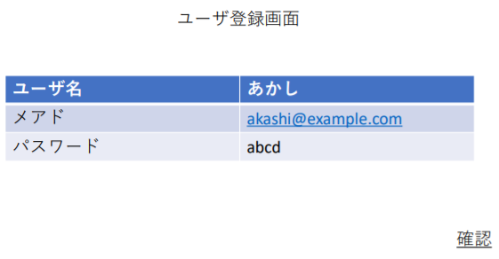
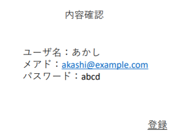

# ユースケース 1： ユーザーを登録する

## 概要
ユーザが、システムに新規ユーザ登録を行う

## アクター
- ユーザ

## 事前条件
- システムにログインしていないこと

## 事後条件
- システムにログイン画面が表示された状態になる
- システムにユーザのユーザ名、メールアドレス、パスワードが登録される

## トリガ―
- ユーザがログイン画面で新規登録を選択する

## 基本フロー
1. システムは、ユーザ登録画面を表示する
2. ユーザは、ユーザ名とメールアドレス、パスワードを入力する
3. システムは、入力された内容で登録してもよいか確認画面を表示する
4. ユーザは、表示された内容で合っていることを確認して登録ボタンを押す
5. システムはメールアドレスが既に存在していないことを確認してユーザリポジトリに情報の登録を行う
6. システムはログイン画面を表示する

## 代替フロー
### 代替フロー1
- 2.a.1 基本フロー２でユーザはログイン画面に戻るボタンを押す
- 2.a.2 システムはログイン画面を表示する
### 代替フロー2
- 3.a.1 基本フロー3で登録内容を修正する場合、ユーザは戻るボタンを押す
- 3.a.2 システムはユーザ登録画面を表示する

## GUI紙芝居
### 入力画面

### 確認画面

