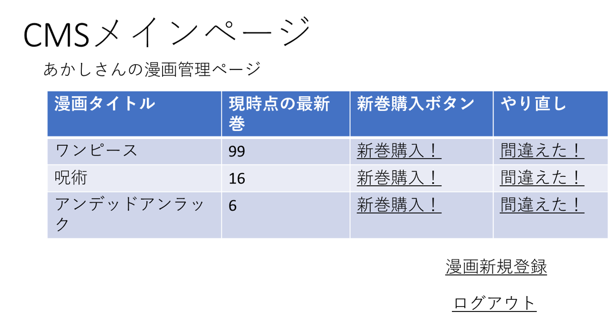

# ユースケース 3： 漫画の一覧を確認する

## 概要
ユーザが自分の漫画、最新巻数を確認する

## アクター
- ユーザ

## 事前条件
- ユーザがシステムにログインしていること

## 事後条件
- ユーザが漫画のタイトルごとの購入状況を確認できる

## トリガ―
- ユーザがログインに成功する

## 基本フロー
1. ユーザがログインに成功する．
2. システムは，みんなの漫画台帳からユーザが登録している漫画のリストを取得する．
3. システムは，メインページを表示する．メインページは漫画タイトル，最新巻数，新規購入済ボタン，やり直しボタンを表示する．
4. ユーザは自分の漫画一覧，最新巻数を確認する．

## 代替フロー

なし

## GUI紙芝居
### メインページ

