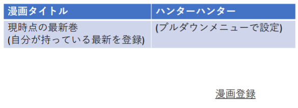

# ユースケース 5： 漫画の新規登録をする

## 概要
ユーザがシステムに登録されていない漫画を新規登録する

## アクター
- ユーザ

## 事前条件
- システムにログインしていること
- システムが漫画の管理画面が表示されていること

## 事後条件
- システムに漫画の管理画面が表示された状態になる
- システムに新たな漫画情報が登録される

## トリガ―
- ユーザが、漫画管理画面の漫画の新規登録ボタンを押す

## 基本フロー
1. システムは、漫画の新規登録画面を表示する
2. ユーザは、漫画のタイトルとユーザが現在所持している最新刊数を入力する
3. システムは、入力された内容で登録してもよいか確認画面を表示する
4. ユーザは、表示された内容で合っていることを確認して登録ボタンを押す
5. システムは、登録する漫画が既にシステムに登録されていないことを確認して情報の登録を行う
6. システムは、漫画管理画面を表示する

## 代替フロー
### 代替フロー1
- 2.a.1 基本フロー２で登録をやめる場合ユーザは漫画管理画面に戻るボタンを押す
- 2.a.2 システムは漫画管理画面を表示する
### 代替フロー2
- 3.a.1 基本フロー3で登録内容を修正する場合、ユーザは戻るボタンを押す
- 3.a.2 システムは漫画登録画面を表示する
### 代替フロー3
- 5.a.1 基本フロー5で漫画が既にシステムに登録されていれば、システムは漫画を登録せずに漫画登録画面を表示する

## GUI紙芝居
### 入力画面

